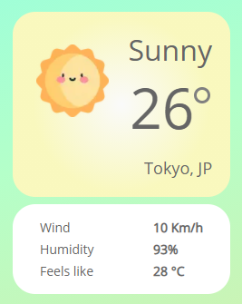
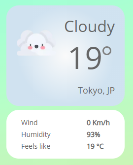
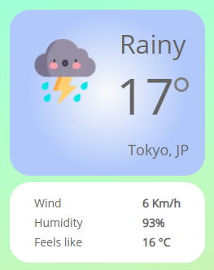

# What's the weather like

A simple project using [NextJs](https://nextjs.org/), a [Weather API](https://openweathermap.org/api) with [Geolocation Web API](https://developer.mozilla.org/pt-BR/docs/Web/API/Geolocation).

## Running

To run the project you will need an api key on the [OpenWeather website](https://openweathermap.org/api), and then clone the `.env.example` using your own API key.

Run `yarn` on the main folder to install libraries.
and `yarn dev` to run the app.

## Screenshots

        
